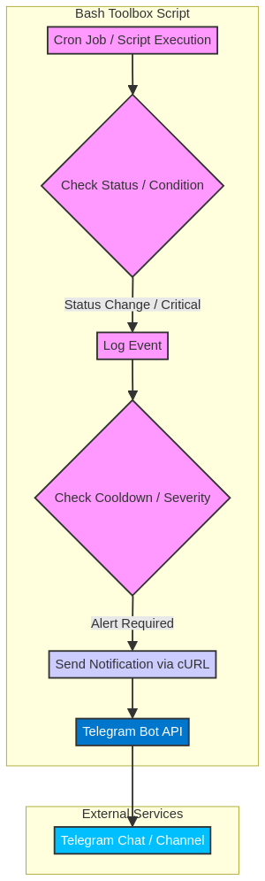

# [ARCHIVED] 🧰 Bash Toolbox

> **Note:** This repository is archived and no longer actively maintained.


[](https://opensource.org/licenses/MIT)
[](https://github.com/ArtemRivnyi/bash-toolbox/commits/main)

Collection of lightweight, cross-platform Bash scripts for developers, sysadmins, and DevOps. Automate system monitoring, service checks, backups, log cleanup, and network tasks with minimal dependencies. Works on Linux, macOS, and hybrid environments.

---

## ✨ Key Features

*   🌍 **Cross-Platform**: Linux, macOS, Windows (Git Bash)
*   📱 **Smart Telegram Alerts**: CRITICAL/WARNING/RECOVERY with cooldown protection
*   ⚡ **Minimal Dependencies**: Only standard utilities (bash, tar, curl, grep, awk)
*   🤖 **Automation-Ready**: Designed for cron jobs and CI/CD pipelines
*   🧩 **Modular**: Self-contained scripts, easy to integrate

---

## 🎯 Use Cases

| Scenario | Scripts Used | Benefit |
| :--- | :--- | :--- |
| **Small IT Teams (10-50 servers)** | `telegram-ping-monitor`, `disk-usage-alert`, `service-health-check` | Low-noise Telegram alerting without heavy monitoring stacks |
| **Edge Computing / IoT** | `system-monitor`, `internet-check` | Minimal footprint for resource-constrained devices |
| **CI/CD Pipelines** | `service-health-check`, `backup-manager` | Pre/post-deployment health verification |
| **Home Lab / Personal Servers** | `log-cleaner`, `disk-usage-alert` | Set-and-forget maintenance |

---

## 🚀 Quick Start

```shell
git clone https://github.com/ArtemRivnyi/bash-toolbox.git
cd bash-toolbox
chmod +x *.sh

# Configure and start monitoring
./telegram-ping-monitor.sh config
./telegram-ping-monitor.sh start
```

---

## 📦 Scripts

### Monitoring Scripts (with Telegram)

| Script | Description | Alert Methods |
| :--- | :--- | :--- |
| `telegram-ping-monitor.sh` | Host availability monitoring (multi-host, status transitions) | Telegram |
| `disk-usage-alert.sh` | Disk space monitoring with dual thresholds (80%/90%) | Console / Telegram / Both |
| `service-health-check.sh` | Service health (systemd/launchctl/sc) | Telegram |
| `internet-check.sh` | Multi-stage connectivity diagnostics (Ping → DNS → HTTP) | Console / Telegram / Both |
| `system-monitor.sh` | CPU/RAM/Disk monitoring with recovery alerts | Console / Telegram / Both |

### Utility Scripts

| Script | Description | Features |
| :--- | :--- | :--- |
| `quick-diagnostics.sh` | Rapid system health assessment | CPU, RAM, Disk, Connectivity checks |
| `docker-cleanup.sh` | Docker containers, images, volumes cleanup | Prunes dangling resources |
| `backup-manager.sh` | Backup creation and management | Compression, retention, restore |
| `log-cleaner.sh` | Log cleanup & rotation | Age-based, count-based, dry-run |

All monitoring scripts share a unified command interface:

```shell
./script.sh config   # Interactive configuration
./script.sh start    # Start monitoring loop
./script.sh status   # Show current status
./script.sh test     # Test notifications
./script.sh log      # Display recent logs
./script.sh help     # Show usage info
```

---

## 💡 Notification Architecture

Scripts use **stateful alerting** — you only get notified on state *changes* (e.g., UP → CRITICAL, CRITICAL → RECOVERY), not on every check.



---

## 🆕 Roadmap

| Priority | Feature | Status |
| :--- | :--- | :--- |
| v1.1 | Smart Telegram for all monitors | ✅ Done |
| v1.1 | Severity levels (CRITICAL/WARNING/INFO) | ✅ Done |
| v1.2 | Email notifications (fallback) | ⏳ Planned |
| v1.2 | Webhook support (Slack, Discord, Teams) | ⏳ Planned |
| v2.0 | Prometheus exporter + Grafana templates | ⏳ Planned |

---

## 🤝 Contributing

Contributions welcome! Fork → feature branch → PR. Follow existing code style and test on Linux/macOS.

## 📄 License

MIT License. See [LICENSE](LICENSE) for details.

## 🧰 Maintainer

**Artem Rivnyi** — Junior Technical Support / DevOps Enthusiast

* 📧 [artemrivnyi@outlook.com](mailto:artemrivnyi@outlook.com)
* 🔗 [LinkedIn](https://www.linkedin.com/in/artem-rivnyi/)
* 🌐 [Personal Projects](https://personal-page-devops.onrender.com/)
* 💻 [GitHub](https://github.com/ArtemRivnyi)

